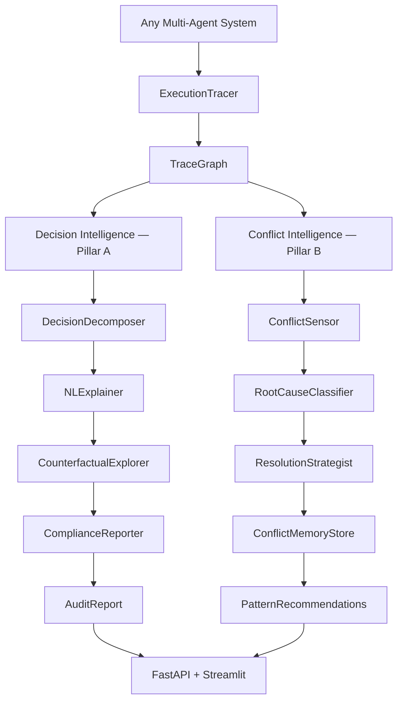
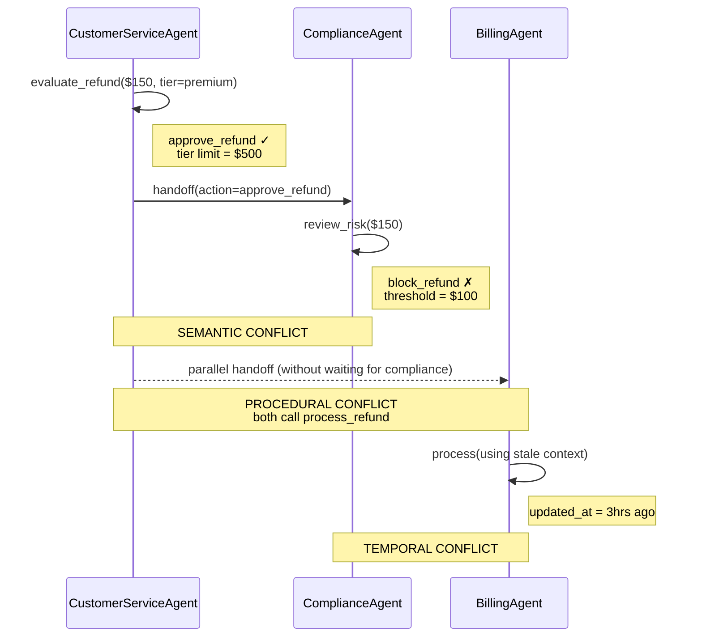

<div align="center">

# Faultline

**Framework-agnostic observability & governance for autonomous AI systems.**

[](https://python.org)
[](https://fastapi.tiangolo.com)
[](https://streamlit.io)
[](./agentwatch/tests)
[](./LICENSE)

</div>

---

Autonomous AI systems fail differently than deterministic software. They don't throw exceptions. They don't return error codes. They make decisions — often conflicting ones — and those decisions propagate downstream before anyone notices.

Faultline is the observability layer that sits above your agent pipeline. It captures every decision, detects every conflict, traces every root cause, and generates audit-ready explanations — without touching your agent code.

---

## Why This Exists

When a microservice fails, you get a stack trace. When an autonomous agent fails, you get a confused customer.

The operational gap is structural:

- **Decisions propagate silently.** An agent approves a refund. A compliance agent blocks it. Both continue executing. Neither knows about the other.
- **Conflicts are invisible at runtime.** Standard observability tools log what happened. They don't surface when two agents reached contradictory conclusions from the same input.
- **Root cause attribution is manual.** Finding *why* an agent behaved unexpectedly requires reconstructing context, tool calls, and decision sequences by hand.
- **There is no audit trail by default.** In regulated domains — finance, healthcare, legal — "the model decided" is not a compliance-ready explanation.

Faultline treats agent behavior as a first-class observable. Every execution becomes a structured trace graph. Every decision is decomposable, explainable, and auditable.

---

## Architecture

Faultline operates in two parallel analysis pipelines on top of a shared instrumentation layer.



### ExecutionTracer

The instrumentation primitive. Wraps any async agent function via decorator or context manager — zero changes to agent code required. Captures per-event latency, token usage, cost, state hash, and tool call details. Emits a `TraceGraph` on run completion.

```python
tracer = ExecutionTracer(session_id="session-001")

@tracer.trace_agent("router_agent")
async def router_agent(state: dict) -> dict:
    ...

# Or inline for finer control
async with tracer.trace_step("billing", AgentEventType.TOOL_CALL, ctx) as ev:
    ev.output = await billing_tool.execute(ctx)
    ev.tokens_used = 180
```

### TraceGraph

A structured, versioned graph of every event in a run. Nodes are `AgentEvent` objects. Edges are sequential and cross-agent (handoffs create explicit cross-edges). Both analysis pipelines query this graph — neither reads raw agent code or framework internals.

### Decision Intelligence (Pillar A)

Converts raw execution traces into grounded, human-readable audit trails.

| Component | Function |
|---|---|
| `DecisionDecomposer` | Extracts structured `DecisionNode` objects from events. Batched — one LLM call per run. |
| `NLExplainer` | Generates plain-English audit steps. Every reasoning statement must cite a source event or context key. |
| `CounterfactualExplorer` | Causal what-if analysis. Identifies which context changes flip agent decisions. Sensitivity scored via scipy. |
| `ComplianceReporter` | Assembles `AuditReport` with risk escalation, quantitative compliance metadata, and markdown/JSON export. |

### Conflict Intelligence (Pillar B)

Detects and resolves inter-agent conflicts at handoff points.

| Component | Function |
|---|---|
| `ConflictSensor` | Scans for semantic, procedural, and temporal conflicts. SEMANTIC uses LLM; PROCEDURAL and TEMPORAL are fully deterministic. |
| `RootCauseClassifier` | Attributes conflicts to one of six root cause types using causal reasoning over agent event histories. |
| `ResolutionStrategist` | Selects and applies a resolution strategy (arbitrate / synthesize / reset / escalate) deterministically by conflict type. |
| `ConflictMemoryStore` | Persists conflict patterns across runs. Surfaces specific fix recommendations when patterns recur. |

### Framework-Agnostic by Design

Faultline operates on normalized `TraceGraph` objects, not framework internals. The `ExecutionTracer` is the only integration point — wrap your agents once, swap frameworks freely.

Adapters in development:

- `LangGraphAdapter` — automatic graph traversal instrumentation
- `CrewAIAdapter` — crew execution hook integration
- `AutoGenAdapter` — conversation trace normalization

### Provider Abstraction

`LLMClient` normalizes Anthropic and Groq (OpenAI-compatible) behind a single interface. All agents call `client.chat_with_tool(...)` and receive a plain dict. Swap providers by changing one environment variable.

```bash
GROQ_API_KEY=gsk_...       # Groq — recommended for development (~15x cheaper)
ANTHROPIC_API_KEY=sk-ant-... # Anthropic — production fallback
```

---

## Capabilities

**Execution Tracing**
Instruments any async agent function. Captures latency, token cost, state hash, and tool invocations per event. Detects infinite loops via state hash accumulation before budget exhaustion.

**Decision Decomposition**
Extracts structured decision nodes from raw traces. Identifies decision type, available options, chosen path, and confidence. Marks critical decisions deterministically — handoffs, tool calls, and low-confidence decisions are always flagged.

**Causal Explainability**
Every audit step cites a specific event ID or context key. The NL Explainer is system-prompted to refuse ungrounded statements. Hallucination is prevented structurally, not by hoping the model behaves.

**Conflict Detection**
Three detection methods, two of which require no LLM:
- *Semantic* — LLM checks if agent outputs at handoff points are logically contradictory
- *Procedural* — Deterministic scan for duplicate tool calls within a sequence window
- *Temporal* — Deterministic timestamp comparison against event timestamps

**Root Cause Classification**
Six-type taxonomy: `instruction_ambiguity`, `context_window_mismatch`, `tool_result_divergence`, `logical_contradiction`, `stale_state`, `permission_boundary_violation`. Conservative by design — low-confidence classifications escalate rather than guess.

**Counterfactual Analysis**
Auto-generates context perturbations and reruns affected decision nodes to identify fragile dependencies. Sensitivity scored as a weighted function of outcome change and confidence delta. Powered by scipy.

**Autonomous Conflict Resolution**
Strategy selection is rule-based, not LLM-generated:
- `SYNTHESIZE` — merge outputs (semantic conflicts with high synthesis confidence)
- `ARBITRATE` — higher-sequence agent wins (procedural conflicts)
- `RESET` — rerun with corrected context (temporal conflicts)
- `ESCALATE` — human review required (low root-cause confidence)

**Compliance Reporting**
Structured `AuditReport` with per-step risk levels, counterfactual sensitivity analysis, and a quantitative `compliance_data` block. Exports to JSON and Markdown.

**Memory & Pattern Learning**
`ConflictMemoryStore` accumulates conflict patterns across runs. After two or more occurrences, a specific fix recommendation is surfaced — not generic advice, but agent-specific prompt rewrites and architectural changes.

---

## Demo

The demo pipeline is a deliberately conflicting three-agent customer service system. It generates all three conflict types in a single run.

```
Order: ORD-8821 · Customer: CUST-4492 · Amount: $150 · Tier: premium
```



**What Faultline detects on this run:**

| Conflict | Type | Root Cause | Resolution |
|---|---|---|---|
| CS approves, Compliance blocks | SEMANTIC | `instruction_ambiguity` | SYNTHESIZE → approve with compliance flag |
| Both agents call `process_refund` | PROCEDURAL | `tool_result_divergence` | ARBITRATE → higher-sequence agent wins |
| BillingAgent uses stale `updated_at` | TEMPORAL | `stale_state` | RESET → rerun with corrected context |

---

## Dashboard

Three-tab observability interface. Start with:

```bash
# Terminal 1 — API
uvicorn agentwatch.api.main:app --reload --port 8000

# Terminal 2 — Dashboard  
python -m streamlit run agentwatch/dashboard/app.py
```

### Decision Audit
Run any agent pipeline, paste the Run ID, and get a full 
grounded audit report — risk level, decision trail, 
counterfactual sensitivity analysis, and risk factors.


### Conflict Monitor
Scan any run for inter-agent conflicts. Detects semantic, 
procedural, and temporal conflicts with root cause classification 
and autonomous resolution strategy.


### Memory & Recommendations
Accumulates conflict patterns across runs. Surfaces specific 
architectural fix recommendations when the same pattern 
recurs across multiple runs.


---

## Quick Start

```bash
git clone https://github.com/yourusername/faultline
cd faultline

python -m venv .venv && source .venv/bin/activate
pip install -r requirements.txt

cp .env.example .env
# Add GROQ_API_KEY (recommended) or ANTHROPIC_API_KEY
```

**Run the demo**

```bash
python -m agentwatch.demo.run_demo           # clean terminal output
python -m agentwatch.demo.run_demo --pretty  # full JSON
python -m agentwatch.demo.run_demo --export  # saves demo_audit_report.md
```

**Run the API**

```bash
uvicorn agentwatch.api.main:app --reload
# → http://localhost:8000/docs
```

**Run the dashboard**

```bash
streamlit run agentwatch/dashboard/app.py
# → http://localhost:8501
```

**Run tests**

```bash
pytest agentwatch/tests/ -v
# 55 tests, 0 failures
```

---

## API Reference

| Method | Endpoint | Description |
|---|---|---|
| `POST` | `/trace` | Submit agent run trace for storage |
| `GET` | `/trace/{run_id}` | Retrieve full TraceGraph |
| `POST` | `/audit` | Run Decision Audit pipeline |
| `POST` | `/audit/{run_id}/export` | Export audit as Markdown |
| `POST` | `/conflicts/scan/{run_id}` | Run Conflict Intelligence pipeline |
| `GET` | `/conflicts/patterns` | Get accumulated conflict patterns |
| `GET` | `/conflicts/recommendations` | Get architectural fix recommendations |
| `POST` | `/conflicts/{id}/resolve` | Manually trigger resolution |
| `GET` | `/health` | System health |

---

## Environment

```bash
# Provider — pick one
GROQ_API_KEY=gsk_...
GROQ_MODEL=llama-3.3-70b-versatile        # default

ANTHROPIC_API_KEY=sk-ant-...
ANTHROPIC_MODEL=claude-sonnet-4-20250514  # fallback

# Storage
DATABASE_URL=sqlite+aiosqlite:///faultline.db
CONFLICT_MEMORY_PATH=conflict_memory.json

# Config
LOG_LEVEL=INFO
LOOP_DETECTION_THRESHOLD=3
```

---

## Repository Structure

```
faultline/
├── agentwatch/
│   ├── core/
│   │   ├── models/
│   │   │   └── schemas.py          # All Pydantic v2 data models
│   │   ├── tracer/
│   │   │   └── execution_tracer.py # Instrumentation layer + Loop Killer
│   │   ├── store/
│   │   │   └── trace_store.py      # Async SQLite persistence
│   │   └── llm/
│   │       └── client.py           # Provider-agnostic LLM abstraction
│   ├── agents/
│   │   ├── auditor/                # Decision Intelligence — Pillar A
│   │   │   ├── decision_decomposer.py
│   │   │   ├── nl_explainer.py
│   │   │   ├── counterfactual_explorer.py
│   │   │   └── compliance_reporter.py
│   │   └── conflict/               # Conflict Intelligence — Pillar B
│   │       ├── conflict_sensor.py
│   │       ├── root_cause_classifier.py
│   │       ├── resolution_strategist.py
│   │       └── conflict_memory.py
│   ├── api/
│   │   ├── main.py                 # FastAPI app + middleware
│   │   ├── dependencies.py         # Dependency injection
│   │   └── routes/
│   │       ├── trace_routes.py
│   │       ├── audit_routes.py
│   │       └── conflict_routes.py
│   ├── dashboard/
│   │   └── app.py                  # Streamlit UI
│   ├── demo/
│   │   ├── demo_agents.py          # Deliberately conflicting agent system
│   │   └── run_demo.py             # End-to-end demo runner
│   └── tests/
│       ├── test_tracer.py          # 10 tests
│       ├── test_auditor.py         # 25 tests
│       └── test_conflict.py        # 20 tests
├── requirements.txt
├── pyproject.toml
└── .env.example
```

---

## Roadmap

- [ ] **LangGraph adapter** — automatic instrumentation via graph traversal hooks
- [ ] **OpenTelemetry export** — emit trace spans to any OTLP-compatible backend
- [ ] **Live replay visualization** — step through agent runs interactively in the dashboard
- [ ] **Distributed tracing** — cross-service trace correlation for multi-process agent systems
- [ ] **Risk scoring model** — ML-based pre-deployment risk assessment trained on conflict history
- [ ] **Governance policies** — declarative rules engine for enforcement at the orchestration layer
- [ ] **Multi-provider arbitration** — route LLM calls by cost, latency, and task type dynamically
- [ ] **CrewAI / AutoGen adapters** — first-class instrumentation without manual trace_step calls

---

## Design Decisions

**Why a graph and not a vector store for the TraceGraph?**
Structural relationships between events — what depends on what, which handoff triggered which conflict — are graph queries, not similarity searches. "Is this import cycle reachable from the public API layer?" is not a retrieval problem.

**Why is `is_critical` rule-based and not LLM-generated?**
Handoffs, tool calls, and low-confidence decisions are always critical. Making this deterministic means it's testable, reproducible, and immune to LLM variance on the most important flag in the system.

**Why does PROCEDURAL conflict detection require no LLM?**
Two agents calling the same tool within a sequence window is structurally detectable from event metadata. Using an LLM to detect this would add latency, cost, and hallucination risk to a problem with a deterministic solution.

**Why Groq by default?**
`llama-3.3-70b-versatile` on Groq is approximately 15x cheaper than Claude Sonnet for equivalent structured output tasks. For a system that may run 5-10 LLM calls per agent pipeline, this makes the difference between a $0.001 observation cost and a $0.015 one.

---

## License

MIT — see [LICENSE](./LICENSE)

---

<div align="center">
<sub>Built by a data scientist who got tired of finding out agents disagreed from customer complaints.</sub>
</div>